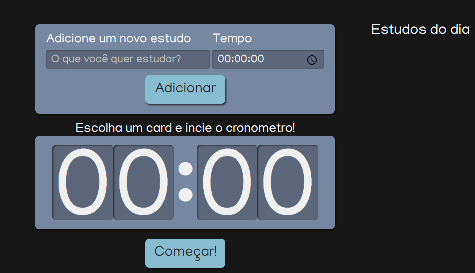

    <h1>ALURA STUDIES</h1>
    <h5>
        Projeto desenvolvido no curso de 'React: escrevendo com TypeScript' da Alura
    </h5>
    <h2>DESCRIÇÃO</h2>
    
O Alura studies é uma ferramenta para auxilar no controle dos estudos diários. Com essa ferramenta você pode criar uma lista de matérias a serem estudadas e seus respectivos tempos de estudo. A lista criada é exibida no 'Estudo do dia', e ao clicar em uma das tarefas criadas, o tempo aprecerá no cronômetro e ao clicar no botão 'Começar', ele irá iniciar uma contagem regressiva de acordo com o tempo da tarefa escolhida. obs: Nesse projeto não foi utilizado banco de dados, portanto a lista não fica salva ao fechar ou recarregar a página.

    <h2>PRINT DA TELA</h2>
    
    <h2 > FERRAMENTAS UTILIZADAS:</h2>
    

        <li >REACT</li>
        <li >TYPESCRIPT</li>
        <li >JAVASCRIPT</li>
        <li >CSS - SASS</li>
    

     
    
    ' 
