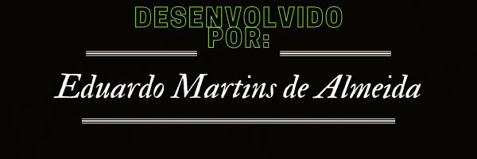

<h1 align = center> ALURA STUDIES</h1>

Projeto desenvolvido no curso de 'React: escrevendo com TypeScript' da Alura

<h2 align = center>DESCRIÇÃO</h2>

O Alura studies é uma ferramenta para auxiliar no controle dos estudos diários. Com essa ferramenta você pode criar uma lista de matérias a serem estudadas e seus respectivos tempos de estudo. A lista criada é exibida no 'Estudo do dia', e ao clicar em uma das tarefas criadas, o tempo aparecerá no cronômetro e ao clicar no botão 'Começar', ele irá iniciar uma contagem regressiva de acordo com o tempo da tarefa escolhida. obs.: Nesse projeto não foi utilizado banco de dados, portanto a lista não fica salva ao fechar ou recarregar a página.

<h2 align = center>PRINT DA TELA</h2>

  

<h2 align = center> FERRAMENTAS UTILIZADAS:</h2>

    <li align = center>REACT</li>
    <li align = center>TYPESCRIPT</li>
    <li align = center>JAVASCRIPT</li>
    <li align = center>CSS - SASS</li>

 

 

